<h1 align="center">✨ Hiya! I'm Jonathan ✨</h1>

💼 I work in networking, as a hypnotherapist, and of course, a programmer! 💼

🎓 I hold a BS in Organizational Psychology and a BS in Information Technology. 🎓

😍 I'm obsessed with efficient program architecture, flexible design, and dynamic systems. 😍

🔧 I'm currently working on <b>Merlin</b> — a private modular website system for full-stack development. 🔧

---

<h3 align="center">🌐 Socials</h3>

  
  
  

---

<h3 align="center">💻 Tools I Love</h3>

  
  
  
  
  
  
  
  
  
  
  

---

<h3 align="center">📊 GitHub Stats</h3>

  

  

  

<!--
**JartanFTW/JartanFTW** is a ✨ _special_ ✨ repository because its `README.md` (this file) appears on your GitHub profile.

Here are some ideas to get you started:

- 🔭 I’m currently working on ...
- 🌱 I’m currently learning ...
- 👯 I’m looking to collaborate on ...
- 🤔 I’m looking for help with ...
- 💬 Ask me about ...
- 📫 How to reach me: ...
- 😄 Pronouns: ...
- ⚡ Fun fact: ...
-->
