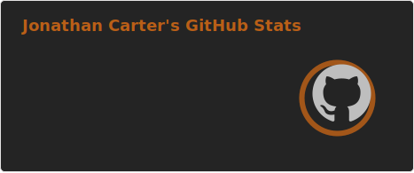
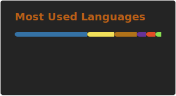

<h1 align="center">✨ Hiya! I'm Jonathan ✨</h1>

💼 I work as a project manager, as a hypnotherapist, and of course, a programmer! 💼

🎓 I hold a BS in Organizational Psychology and a BS in Information Technology. 🎓

😍 I'm obsessed with efficient program architecture, flexible design, and dynamic systems. 😍

🛠 I'm currently working on <b>Merlin</b> — a private modular website framework for full-stack development. 🛠

---

<h3 align="center">📜 Quote of the Day 📜 </h3>

<i><!--QUOTE_TEXT_START-->Highly annealed nervous systems are powerful stress-dissipation engines.<!--QUOTE_TEXT_END--></i>

<!--QUOTE_AUTHOR_START-->— Andrés Gómez-Emilsson<!--QUOTE_AUTHOR_END-->

---

<h3 align="center">💻 Tools I Love 💻</h3>

  
  
  
  
  
  
  
  
  
  
  

---

<h3 align="center">🌐 Socials 🌐</h3>

  
  
  
  

---

  

  

  

---

<h3 align="center">🌟 Fun Facts About Me 🌟</h3>

• I've been programming asynchronous code since I was 11.

• I build and work in <a href="https://github.com/devcontainers/">devcontainers</a> for clean reproducibility and effortless onboarding.

...more to come as I think about it

<!--
**JartanFTW/JartanFTW** is a ✨ _special_ ✨ repository because its `README.md` (this file) appears on your GitHub profile.

Here are some ideas to get you started:

- 🔭 I’m currently working on ...
- 🌱 I’m currently learning ...
- 👯 I’m looking to collaborate on ...
- 🤔 I’m looking for help with ...
- 💬 Ask me about ...
- 📫 How to reach me: ...
- 😄 Pronouns: ...
- ⚡ Fun fact: ...
-->
